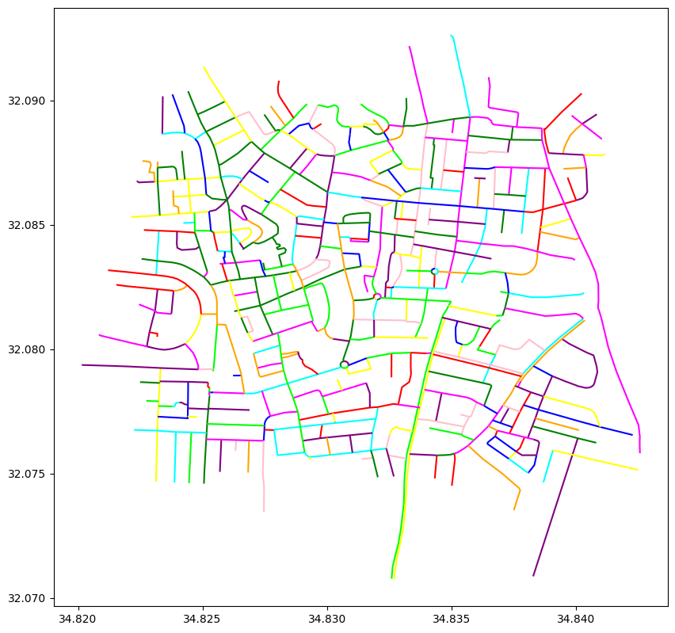

# StreetPainter

# Description

This Flask App is a dockerized application that utilizes an algorithm designed to process Esri Shapefiles with a streets layer. The algorithm performs a series of steps to manipulate the data and generate a visual representation of the street network. The resulting image is returned in base64 format.

The algorithm consists of the following steps:

1. **Azimuth Calculation**: For each simple LineString in the Shapefile, an azimuth value is calculated. The azimuth represents the direction of the line segment in degrees, relative to a reference direction.

2. **Grouping by Azimuth**: The line segments are then grouped into six distinct groups based on their azimuth values. This grouping allows for easier identification and processing of lines that have similar orientations.

3. **Merging LineStrings**: Within each group, the algorithm identifies LineStrings that share common endpoints. These LineStrings are merged together to create longer, connected segments. This step helps simplify the street network representation and reduce the complexity of the final image.

4. **Random Color Assignment**: After the LineStrings have been merged, each resulting segment is assigned a random color. This color assignment adds visual distinction to the street network and helps differentiate individual segments.

5. **Image Generation**: Finally, the algorithm generates an image of the processed street network. The image is encoded in base64 format, allowing for easy integration and display in web applications or other software systems.

By following these steps, the algorithm transforms the input Esri Shapefile into a visually appealing representation of the street network, where segments are merged and colored based on their orientation.

# Prerequisites

Before using this Flask App, make sure you have the following:

- Docker installed on your system
- An Esri Shapefile containing a streets layer as input

# Usage

1. Clone or download the repository to your local machine.
2. Place your Esri Shapefile in the designated folder.
3. Open a terminal and navigate to the project directory.
4. Make the `run.sh` script executable by running the command `chmod +x run.sh`.
5. Run the shell script `run.sh` using the command `./run.sh`. This script will build the Docker image and launch the Flask App container.
6. Access the app through your web browser at `http://localhost:5000` and follow the instructions to upload the Shapefile.
7. After the processing is complete, the resulting image will be displayed and can be downloaded in base64 format.

Make sure to run the `chmod +x run.sh` command before executing the `run.sh` script to ensure it has the necessary execution permissions.

# Examples

Here are a few examples of the output generated by the algorithm:

# Contact

If you have any questions, feedback, or suggestions, please contact [natalihreshchyshyn@gmail.com](mailto:natalihreshchyshyn@gmail.com). We would love to hear from you!
